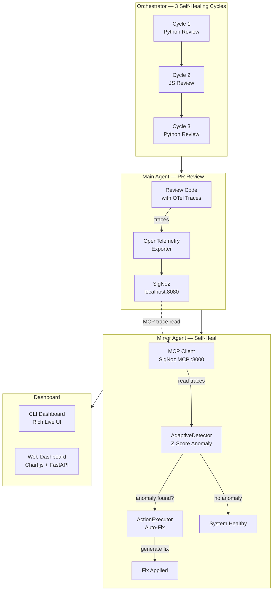

# MERA - Mirror Entity Recursive Agent

> **Track:** 03 - Build Your Own | **Team:** Team Enthusiast
> **University:** Dr. Kiran & Pallavi Patel Global University, KPGU Vadodara

## What is MERA?

A **self-healing AI agent** system:
1. **Main Agent** — code review with OpenTelemetry instrumentation
2. **Mirror Agent** — reads own traces via SigNoz MCP, detects anomalies, generates fixes
3. **Orchestrator** — 3 self-healing cycles
4. **Dashboard** — live terminal UI + FastAPI web dashboard



## Quick Start

```bash
pip install -r requirements.txt
pip install rich                # optional: live terminal dashboard
python run.py
```

Terminal dashboard: http://localhost:9000 · SigNoz: http://localhost:8080

## Scripts

| Script | Purpose |
|---|---|
| `scripts/setup.bat` | Install deps, create .env |
| `scripts/run_demo.bat` | Run demo with pause |
| `scripts/cleanup.bat` | Stop Foundry/Docker, remove state |
| `scripts/import_dashboard.py` | Auto-import SigNoz dashboard |

## Tests

```bash
pytest tests/ -v -m "not llm"   # 25 tests (no Ollama needed)
pytest tests/ -v                 # all 27 tests (needs Ollama)
```

## Structure

```
Track_3/
  main_agent/agent.py       # PR Reviewer with OTel
  mirror_agent/mirror.py    # Observer + auto-healer
  dashboard/app.py          # FastAPI web dashboard
  dashboard/cli.py          # Live terminal UI (rich)
  state.py                  # Shared state (auto-resets on run)
  signoz_config/            # OTel collector config
  dashboards/               # SigNoz dashboard template
  tests/test_mera.py        # 27 tests (25 non-LLM + 2 LLM)
  scripts/                  # Setup, demo, cleanup, import
  casting.yaml              # Foundry deployment config
  run.py                    # Orchestrator
